# GodLife ERD

> 이 문서는 `db/01-schema.sql` 에서 자동으로 만든 것입니다. 직접 고치지 말고 스키마를 고친 뒤 `python docs/gen-erd.py` 를 다시 돌리세요.

MySQL 8.0 / InnoDB / utf8mb4 · 테이블 58개 · 외래 키 89개

설계 원칙

- 포인트 · 금액은 모두 `BIGINT`(정수 포인트). 잔액의 진실은 `point_transactions` 합계이고 `wallets` 는 캐시이자 락 앵커입니다.
- 출금 · 환전 테이블은 일부러 두지 않았습니다 (폐쇄형 포인트 경제).
- 카드 정보 컬럼이 없습니다. 결제는 PG 토큰만 저장하고 테스트 모드로만 연동합니다.
- 삭제는 기본 RESTRICT. 회원은 물리 삭제 대신 `status = WITHDRAWN`, 토큰류만 회원 삭제 시 CASCADE.

## 영역

| 영역 | 테이블 수 | 테이블 |
|---|---:|---|
| 01. 계정 · 인증 · 티어 | 7 | [`tiers`](#tiers), [`users`](#users), [`social_accounts`](#social_accounts), [`phone_verifications`](#phone_verifications), [`devices`](#devices), [`refresh_tokens`](#refresh_tokens), [`password_reset_tokens`](#password_reset_tokens) |
| 02. 챌린지 코어 | 7 | [`categories`](#categories), [`category_sub_types`](#category_sub_types), [`challenges`](#challenges), [`challenge_participants`](#challenge_participants), [`chat_messages`](#chat_messages), [`user_blocks`](#user_blocks), [`chat_reports`](#chat_reports) |
| 03. 인증 · AI 검증 | 5 | [`verifications`](#verifications), [`ai_inference_results`](#ai_inference_results), [`image_embeddings`](#image_embeddings), [`review_queue`](#review_queue), [`reports`](#reports) |
| 04. 포인트 · 원장 · 정산 | 5 | [`wallets`](#wallets), [`point_transactions`](#point_transactions), [`settlements`](#settlements), [`settlement_items`](#settlement_items), [`daily_settlements`](#daily_settlements) |
| 05. 결제 (테스트 모드 전용) | 1 | [`payments`](#payments) |
| 06. 랭킹 · 시즌 | 3 | [`user_stats`](#user_stats), [`seasons`](#seasons), [`season_rankings`](#season_rankings) |
| 07. 부정행위 방지 | 1 | [`collusion_flags`](#collusion_flags) |
| 08. 소셜 · 배지 | 15 | [`badges`](#badges), [`user_badges`](#user_badges), [`follows`](#follows), [`direct_messages`](#direct_messages), [`dm_threads`](#dm_threads), [`diary_entries`](#diary_entries), [`diary_tags`](#diary_tags), [`inquiries`](#inquiries), [`comments`](#comments), [`posts`](#posts), [`post_images`](#post_images), [`post_likes`](#post_likes), [`post_comments`](#post_comments), [`post_comment_likes`](#post_comment_likes), [`community_reports`](#community_reports) |
| 09. 리텐션 | 5 | [`notifications`](#notifications), [`notification_settings`](#notification_settings), [`push_tokens`](#push_tokens), [`push_subscriptions`](#push_subscriptions), [`weekly_reports`](#weekly_reports) |
| 10. 마켓플레이스 | 9 | [`sponsors`](#sponsors), [`product_categories`](#product_categories), [`products`](#products), [`addresses`](#addresses), [`wishlists`](#wishlists), [`cart_items`](#cart_items), [`orders`](#orders), [`order_items`](#order_items), [`order_coupons`](#order_coupons) |

## 전체 관계

컬럼 없이 테이블 사이의 관계만 그린 그림입니다. `||--o{` 는 1:N, `||--o|` 는 1:1, 왼쪽이 `|o` 면 그 외래 키가 NULL 을 받습니다.

```mermaid
erDiagram
    tiers ||--o{ users : "tier_id"
    users ||--o{ social_accounts : "user_id"
    users |o--o{ phone_verifications : "user_id"
    users ||--o{ devices : "user_id"
    users ||--o{ refresh_tokens : "user_id"
    devices |o--o{ refresh_tokens : "device_id"
    users ||--o{ password_reset_tokens : "user_id"
    categories ||--o{ category_sub_types : "category_id"
    users ||--o{ challenges : "host_id"
    categories ||--o{ challenges : "category_id"
    category_sub_types |o--o{ challenges : "sub_type_id"
    challenges ||--o{ challenge_participants : "challenge_id"
    users ||--o{ challenge_participants : "user_id"
    challenges ||--o{ chat_messages : "challenge_id"
    users ||--o{ chat_messages : "sender_id"
    users ||--o{ user_blocks : "blocker_id"
    users ||--o{ user_blocks : "blocked_id"
    challenges ||--o{ chat_reports : "challenge_id"
    chat_messages ||--o{ chat_reports : "message_id"
    users ||--o{ chat_reports : "reporter_id"
    users ||--o{ chat_reports : "reported_user_id"
    challenge_participants ||--o{ verifications : "participant_id"
    verifications ||--o| ai_inference_results : "verification_id"
    verifications |o--o{ ai_inference_results : "duplicate_of_id"
    verifications ||--o| image_embeddings : "verification_id"
    verifications ||--o| review_queue : "verification_id"
    users |o--o{ review_queue : "reviewer_id"
    verifications ||--o{ reports : "verification_id"
    users ||--o{ reports : "reporter_id"
    users ||--o| wallets : "user_id"
    wallets ||--o{ point_transactions : "wallet_id"
    challenges ||--o| settlements : "challenge_id"
    settlements ||--o{ settlement_items : "settlement_id"
    challenge_participants ||--o{ settlement_items : "participant_id"
    point_transactions |o--o{ settlement_items : "refund_tx_id"
    point_transactions |o--o{ settlement_items : "reward_tx_id"
    challenges ||--o{ daily_settlements : "challenge_id"
    users ||--o{ payments : "user_id"
    point_transactions |o--o| payments : "transaction_id"
    users ||--o| user_stats : "user_id"
    seasons ||--o{ season_rankings : "season_id"
    users ||--o{ season_rankings : "user_id"
    challenges ||--o{ collusion_flags : "challenge_id"
    users ||--o{ collusion_flags : "user_a_id"
    users ||--o{ collusion_flags : "user_b_id"
    users ||--o{ user_badges : "user_id"
    badges ||--o{ user_badges : "badge_id"
    users ||--o{ follows : "follower_id"
    users ||--o{ follows : "following_id"
    users ||--o{ direct_messages : "sender_id"
    users ||--o{ direct_messages : "receiver_id"
    challenges |o--o{ direct_messages : "challenge_id"
    users ||--o{ dm_threads : "low_id"
    users ||--o{ dm_threads : "high_id"
    users ||--o{ diary_entries : "user_id"
    diary_entries ||--o{ diary_tags : "diary_id"
    challenges ||--o{ diary_tags : "challenge_id"
    users ||--o{ inquiries : "user_id"
    verifications ||--o{ comments : "verification_id"
    users ||--o{ comments : "user_id"
    users ||--o{ posts : "user_id"
    challenges |o--o{ posts : "challenge_id"
    posts ||--o{ post_images : "post_id"
    posts ||--o{ post_likes : "post_id"
    users ||--o{ post_likes : "user_id"
    posts ||--o{ post_comments : "post_id"
    post_comments |o--o{ post_comments : "parent_id"
    users ||--o{ post_comments : "user_id"
    post_comments ||--o{ post_comment_likes : "comment_id"
    users ||--o{ post_comment_likes : "user_id"
    users ||--o{ community_reports : "reporter_id"
    users ||--o{ notifications : "user_id"
    users ||--o| notification_settings : "user_id"
    users ||--o{ push_tokens : "user_id"
    devices |o--o{ push_tokens : "device_id"
    users ||--o{ push_subscriptions : "user_id"
    users ||--o{ weekly_reports : "user_id"
    sponsors ||--o{ products : "sponsor_id"
    product_categories ||--o{ products : "category_id"
    users ||--o{ addresses : "user_id"
    users ||--o{ wishlists : "user_id"
    products ||--o{ wishlists : "product_id"
    users ||--o{ cart_items : "user_id"
    products ||--o{ cart_items : "product_id"
    users ||--o{ orders : "user_id"
    addresses |o--o{ orders : "address_id"
    orders ||--o{ order_items : "order_id"
    products ||--o{ order_items : "product_id"
    order_items ||--o{ order_coupons : "order_item_id"
```

## 01. 계정 · 인증 · 티어

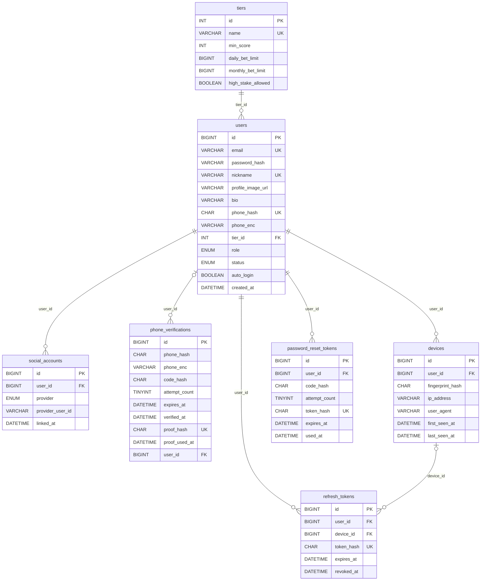

### tiers

티어

| 컬럼 | 타입 | NULL | 키 | 기본값 | 설명 |
|---|---|:---:|---|---|---|
| `id` | `INT` |  | PK |  |  |
| `name` | `VARCHAR(20)` |  | UK |  | BRONZE ~ DIAMOND |
| `min_score` | `INT` |  |  |  | 이 칭호가 되는 점수 (인증 +10, 완주 +50, 실패 -30, 포기 -50). 점수가 내려가면 강등된다 |
| `daily_bet_limit` | `BIGINT` |  |  |  | 일일 총 베팅 상한. 저티어일수록 낮음 |
| `monthly_bet_limit` | `BIGINT` |  |  |  | 월간 총 베팅 상한 |
| `high_stake_allowed` | `BOOLEAN` |  |  | FALSE | 고액 챌린지(참가 포인트 30,000P 이상) 참여 가능 여부 |

### users

회원

| 컬럼 | 타입 | NULL | 키 | 기본값 | 설명 |
|---|---|:---:|---|---|---|
| `id` | `BIGINT` |  | PK |  |  |
| `email` | `VARCHAR(255)` |  | UK |  | 로그인 ID |
| `password_hash` | `VARCHAR(255)` | O |  |  | BCrypt 해시. 소셜 전용 가입자는 NULL |
| `nickname` | `VARCHAR(30)` |  | UK |  |  |
| `profile_image_url` | `VARCHAR(500)` | O |  |  |  |
| `bio` | `VARCHAR(200)` | O |  |  | 자기소개 |
| `phone_hash` | `CHAR(64)` | O | UK |  | 휴대폰 번호 HMAC 해시(원문 미저장). UNIQUE = 계정당 1개 → 다중계정 베팅 악용 방지 |
| `phone_enc` | `VARCHAR(100)` | O |  |  | 휴대폰 번호 암호화 값 (본인에게만 다시 보여 준다) |
| `tier_id` | `INT` |  | FK | 1 | 신규 가입자는 최저 티어(id=1, BRONZE) |
| `role` | `ENUM('USER','ADMIN')` |  |  | 'USER' |  |
| `status` | `ENUM('ACTIVE','SUSPENDED','WITHDRAWN')` |  |  | 'ACTIVE' |  |
| `auto_login` | `BOOLEAN` |  |  | TRUE | 자동 로그인. TRUE = 브라우저를 닫아도 로그인 유지(14일), FALSE = 브라우저를 닫으면 로그아웃 |
| `created_at` | `DATETIME` |  |  | CURRENT_TIMESTAMP |  |

- `tier_id` → [`tiers`](#tiers)

### social_accounts

소셜 로그인 연동

| 컬럼 | 타입 | NULL | 키 | 기본값 | 설명 |
|---|---|:---:|---|---|---|
| `id` | `BIGINT` |  | PK |  |  |
| `user_id` | `BIGINT` |  | FK |  |  |
| `provider` | `ENUM('KAKAO','GOOGLE','NAVER')` |  |  |  |  |
| `provider_user_id` | `VARCHAR(100)` |  |  |  |  |
| `linked_at` | `DATETIME` |  |  | CURRENT_TIMESTAMP |  |

- 유일: (`provider`, `provider_user_id`)
- `user_id` → [`users`](#users) (부모 삭제 시 함께 삭제)

### phone_verifications

휴대폰 본인인증(SMS)

| 컬럼 | 타입 | NULL | 키 | 기본값 | 설명 |
|---|---|:---:|---|---|---|
| `id` | `BIGINT` |  | PK |  |  |
| `phone_hash` | `CHAR(64)` |  |  |  |  |
| `phone_enc` | `VARCHAR(100)` | O |  |  | 인증하는 번호의 암호화 값 (인증이 끝나면 users.phone_enc 로 옮긴다) |
| `code_hash` | `CHAR(64)` |  |  |  | SMS 인증번호 해시 |
| `attempt_count` | `TINYINT` |  |  | 0 | 시도 횟수 제한 |
| `expires_at` | `DATETIME` |  |  |  |  |
| `verified_at` | `DATETIME` | O |  |  |  |
| `proof_hash` | `CHAR(64)` | O | UK |  | 인증 완료 후 발급하는 1회용 증표 해시. 가입/아이디 찾기/번호 등록에 제출 |
| `proof_used_at` | `DATETIME` | O |  |  | 증표 사용 시각 (재사용 방지) |
| `user_id` | `BIGINT` | O | FK |  | 가입 도중에는 아직 user 가 없을 수 있어 NULL 허용 |

- `user_id` → [`users`](#users) (부모 삭제 시 함께 삭제)

### devices

기기 지문 (같은 기기/IP 대량 가입 탐지)

| 컬럼 | 타입 | NULL | 키 | 기본값 | 설명 |
|---|---|:---:|---|---|---|
| `id` | `BIGINT` |  | PK |  |  |
| `user_id` | `BIGINT` |  | FK |  |  |
| `fingerprint_hash` | `CHAR(64)` |  |  |  | 기기 핑거프린트 해시 |
| `ip_address` | `VARCHAR(45)` |  |  |  |  |
| `user_agent` | `VARCHAR(255)` | O |  |  |  |
| `first_seen_at` | `DATETIME` |  |  | CURRENT_TIMESTAMP |  |
| `last_seen_at` | `DATETIME` |  |  | CURRENT_TIMESTAMP |  |

- 유일: (`user_id`, `fingerprint_hash`)
- `user_id` → [`users`](#users)

### refresh_tokens

리프레시 토큰

| 컬럼 | 타입 | NULL | 키 | 기본값 | 설명 |
|---|---|:---:|---|---|---|
| `id` | `BIGINT` |  | PK |  |  |
| `user_id` | `BIGINT` |  | FK |  |  |
| `device_id` | `BIGINT` | O | FK |  |  |
| `token_hash` | `CHAR(64)` |  | UK |  | 토큰 원문 미저장 |
| `expires_at` | `DATETIME` |  |  |  |  |
| `revoked_at` | `DATETIME` | O |  |  | 로그아웃 = 현재 기기 토큰만 폐기 |

- `user_id` → [`users`](#users) (부모 삭제 시 함께 삭제)
- `device_id` → [`devices`](#devices) (부모 삭제 시 NULL)

### password_reset_tokens

비밀번호 재설정 토큰

| 컬럼 | 타입 | NULL | 키 | 기본값 | 설명 |
|---|---|:---:|---|---|---|
| `id` | `BIGINT` |  | PK |  |  |
| `user_id` | `BIGINT` |  | FK |  |  |
| `code_hash` | `CHAR(64)` |  |  |  | 이메일로 보낸 6자리 인증번호 해시 |
| `attempt_count` | `TINYINT` |  |  | 0 | 인증번호 시도 횟수 제한 |
| `token_hash` | `CHAR(64)` | O | UK |  | 인증번호 확인 후 발급하는 1회용 재설정 토큰 해시 |
| `expires_at` | `DATETIME` |  |  |  |  |
| `used_at` | `DATETIME` | O |  |  |  |

- `user_id` → [`users`](#users) (부모 삭제 시 함께 삭제)

## 02. 챌린지 코어

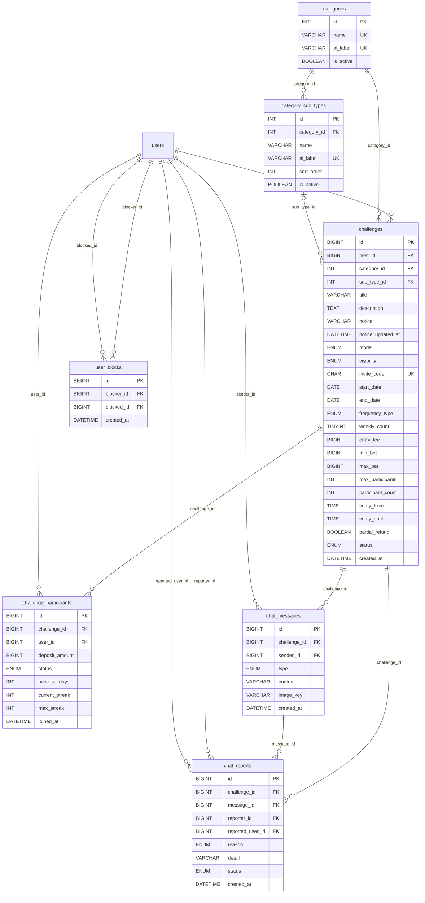

### categories

챌린지 카테고리

| 컬럼 | 타입 | NULL | 키 | 기본값 | 설명 |
|---|---|:---:|---|---|---|
| `id` | `INT` |  | PK |  |  |
| `name` | `VARCHAR(30)` |  | UK |  | 운동 · 공부 · 독서 … |
| `ai_label` | `VARCHAR(50)` |  | UK |  | AI 분류 모델 클래스 라벨과 1:1 매핑 |
| `is_active` | `BOOLEAN` |  |  | TRUE |  |

### category_sub_types

카테고리 세부 종류 (지금은 기타만)

| 컬럼 | 타입 | NULL | 키 | 기본값 | 설명 |
|---|---|:---:|---|---|---|
| `id` | `INT` |  | PK |  |  |
| `category_id` | `INT` |  | FK |  |  |
| `name` | `VARCHAR(30)` |  |  |  | 일찍 일어나기 · 산책 … |
| `ai_label` | `VARCHAR(50)` |  | UK |  | AI 분류 모델 클래스 라벨과 1:1 매핑 |
| `sort_order` | `INT` |  |  | 0 |  |
| `is_active` | `BOOLEAN` |  |  | TRUE |  |

- 유일: (`category_id`, `name`)
- `category_id` → [`categories`](#categories)

### challenges

챌린지

| 컬럼 | 타입 | NULL | 키 | 기본값 | 설명 |
|---|---|:---:|---|---|---|
| `id` | `BIGINT` |  | PK |  |  |
| `host_id` | `BIGINT` |  | FK |  | 개설자 |
| `category_id` | `INT` |  | FK |  |  |
| `sub_type_id` | `INT` | O | FK |  | 카테고리 세부 종류 (기타만, 고르지 않으면 NULL) |
| `title` | `VARCHAR(100)` |  |  |  |  |
| `description` | `TEXT` |  |  |  |  |
| `notice` | `VARCHAR(300)` | O |  |  | 방장 공지. 채팅방 맨 위 고정 |
| `notice_updated_at` | `DATETIME` | O |  |  |  |
| `mode` | `ENUM('FREE','BET')` |  |  |  | FREE(무료) · BET(베팅) |
| `visibility` | `ENUM('PUBLIC','PRIVATE')` |  |  | 'PUBLIC' | PRIVATE = 목록에 안 나오고 초대 링크로만 참여 |
| `invite_code` | `CHAR(8)` |  | UK |  | 초대 링크 코드. 헷갈리는 글자(0/O/1/I/L) 없는 영숫자 |
| `start_date` | `DATE` |  |  |  |  |
| `end_date` | `DATE` |  |  |  |  |
| `frequency_type` | `ENUM('DAILY','WEEKLY_N')` |  |  |  |  |
| `weekly_count` | `TINYINT` | O |  |  | WEEKLY_N 일 때 주 N회 |
| `entry_fee` | `BIGINT` |  |  | 0 | 개설자가 정한 참가비(예치 포인트). FREE 모드는 0 |
| `min_bet` | `BIGINT` |  |  | 0 | 1회 최소 예치 포인트 |
| `max_bet` | `BIGINT` |  |  | 0 | 1회 최대 예치 포인트 |
| `max_participants` | `INT` |  |  |  |  |
| `participant_count` | `INT` |  |  | 0 | 인기순 정렬용 비정규화 카운터 |
| `verify_from` | `TIME` | O |  |  | 인증 가능 시간대(옵션). 예: 새벽 기상 ~06시 |
| `verify_until` | `TIME` | O |  |  |  |
| `partial_refund` | `BOOLEAN` |  |  | FALSE | 부분 성공 시 비례 환급 옵션 |
| `status` | `ENUM('RECRUITING','ONGOING','ENDED','SETTLED')` |  |  | 'RECRUITING' |  |
| `created_at` | `DATETIME` |  |  | CURRENT_TIMESTAMP |  |

- `host_id` → [`users`](#users)
- `category_id` → [`categories`](#categories)
- `sub_type_id` → [`category_sub_types`](#category_sub_types)

### challenge_participants

챌린지 참가자

| 컬럼 | 타입 | NULL | 키 | 기본값 | 설명 |
|---|---|:---:|---|---|---|
| `id` | `BIGINT` |  | PK |  |  |
| `challenge_id` | `BIGINT` |  | FK |  |  |
| `user_id` | `BIGINT` |  | FK |  |  |
| `deposit_amount` | `BIGINT` |  |  | 0 | 참가 시점 예치 포인트 스냅샷 |
| `status` | `ENUM('ACTIVE','COMPLETED','FAILED','GAVE_UP','LEFT','KICKED')` |  |  | 'ACTIVE' | COMPLETED/FAILED = 종료 시 판정, GAVE_UP = 진행 중 포기, KICKED = 방장이 내보냄 |
| `success_days` | `INT` |  |  | 0 | 인증 성공 일수 (승인 시 증가) |
| `current_streak` | `INT` |  |  | 0 |  |
| `max_streak` | `INT` |  |  | 0 |  |
| `joined_at` | `DATETIME` |  |  | CURRENT_TIMESTAMP |  |

- 유일: (`challenge_id`, `user_id`)
- `challenge_id` → [`challenges`](#challenges)
- `user_id` → [`users`](#users)

### chat_messages

챌린지 오픈채팅 메시지

| 컬럼 | 타입 | NULL | 키 | 기본값 | 설명 |
|---|---|:---:|---|---|---|
| `id` | `BIGINT` |  | PK |  |  |
| `challenge_id` | `BIGINT` |  | FK |  | 챌린지 1개 = 채팅방 1개 |
| `sender_id` | `BIGINT` |  | FK |  |  |
| `type` | `ENUM('USER','SYSTEM')` |  |  | 'USER' | SYSTEM = 강퇴·공지 알림 (sender 는 방장) |
| `content` | `VARCHAR(500)` | O |  |  | 글. 사진만 보낸 메시지는 NULL |
| `image_key` | `VARCHAR(80)` | O |  |  | 사진 파일 키(서버가 만든 이름). 참가자만 내려받을 수 있다 |
| `created_at` | `DATETIME(3)` |  |  | CURRENT_TIMESTAMP(3) |  |

- `challenge_id` → [`challenges`](#challenges)
- `sender_id` → [`users`](#users)

### user_blocks

사용자 차단

| 컬럼 | 타입 | NULL | 키 | 기본값 | 설명 |
|---|---|:---:|---|---|---|
| `id` | `BIGINT` |  | PK |  |  |
| `blocker_id` | `BIGINT` |  | FK |  |  |
| `blocked_id` | `BIGINT` |  | FK |  |  |
| `created_at` | `DATETIME` |  |  | CURRENT_TIMESTAMP |  |

- 유일: (`blocker_id`, `blocked_id`)
- `blocker_id` → [`users`](#users)
- `blocked_id` → [`users`](#users)

### chat_reports

오픈채팅 신고

| 컬럼 | 타입 | NULL | 키 | 기본값 | 설명 |
|---|---|:---:|---|---|---|
| `id` | `BIGINT` |  | PK |  |  |
| `challenge_id` | `BIGINT` |  | FK |  |  |
| `message_id` | `BIGINT` |  | FK |  |  |
| `reporter_id` | `BIGINT` |  | FK |  |  |
| `reported_user_id` | `BIGINT` |  | FK |  |  |
| `reason` | `ENUM('ABUSE','SPAM','INAPPROPRIATE','OTHER')` |  |  |  | 욕설·비방 / 스팸·광고 / 부적절한 내용 / 기타 |
| `detail` | `VARCHAR(300)` | O |  |  |  |
| `status` | `ENUM('OPEN','RESOLVED')` |  |  | 'OPEN' | RESOLVED = 방장이 강퇴하거나 넘김 |
| `created_at` | `DATETIME` |  |  | CURRENT_TIMESTAMP |  |

- 유일: (`message_id`, `reporter_id`)
- `challenge_id` → [`challenges`](#challenges)
- `message_id` → [`chat_messages`](#chat_messages)
- `reporter_id` → [`users`](#users)
- `reported_user_id` → [`users`](#users)

## 03. 인증 · AI 검증

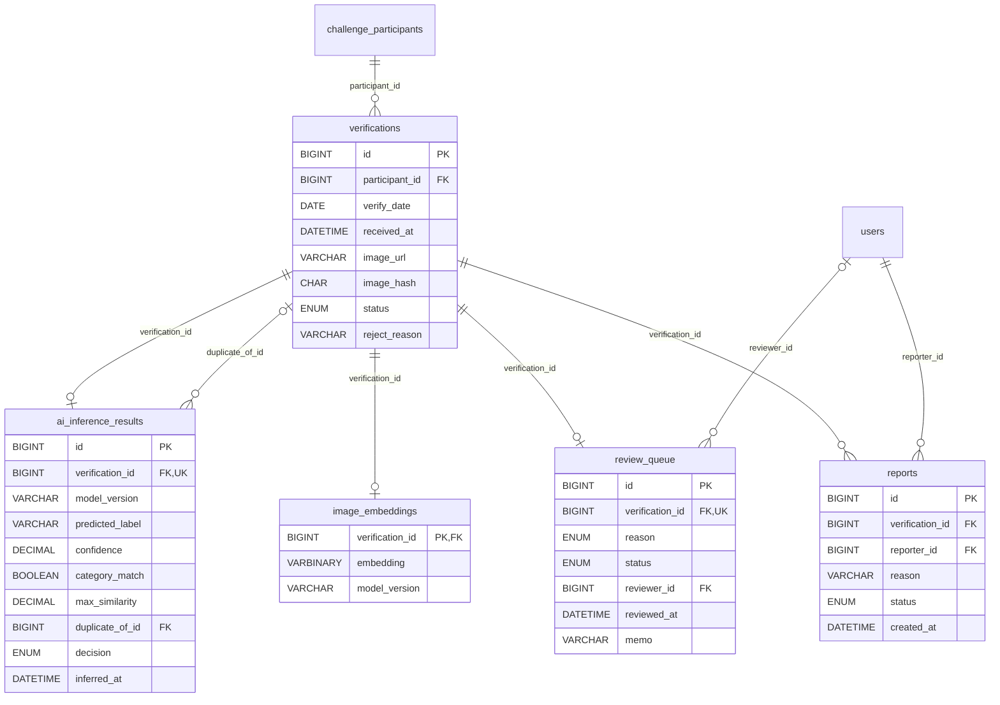

### verifications

인증 제출

| 컬럼 | 타입 | NULL | 키 | 기본값 | 설명 |
|---|---|:---:|---|---|---|
| `id` | `BIGINT` |  | PK |  |  |
| `participant_id` | `BIGINT` |  | FK |  |  |
| `verify_date` | `DATE` |  |  |  | 서버 수신 시각 기준 날짜 |
| `received_at` | `DATETIME(3)` |  |  | CURRENT_TIMESTAMP(3) | 서버 수신 시각. 클라이언트 시각은 신뢰하지 않음 |
| `image_url` | `VARCHAR(500)` |  |  |  | 카메라 직촬 사진 (갤러리 업로드 차단) |
| `image_hash` | `CHAR(64)` |  |  |  | SHA-256. 바이트 단위 동일 사진 즉시 탐지 |
| `status` | `ENUM('PENDING','APPROVED','REJECTED','IN_REVIEW')` |  |  | 'PENDING' |  |
| `reject_reason` | `VARCHAR(100)` | O |  |  |  |

- 유일: (`participant_id`, `verify_date`)
- `participant_id` → [`challenge_participants`](#challenge_participants)

### ai_inference_results

AI 판정 결과

| 컬럼 | 타입 | NULL | 키 | 기본값 | 설명 |
|---|---|:---:|---|---|---|
| `id` | `BIGINT` |  | PK |  |  |
| `verification_id` | `BIGINT` |  | FK, UK |  |  |
| `model_version` | `VARCHAR(30)` |  |  |  | 파인튜닝 모델 버전 (직접 학습, ai-server 서빙) |
| `predicted_label` | `VARCHAR(50)` |  |  |  |  |
| `confidence` | `DECIMAL(5,4)` |  |  |  |  |
| `category_match` | `BOOLEAN` |  |  |  | 예측 라벨 == 챌린지 카테고리 ai_label |
| `max_similarity` | `DECIMAL(5,4)` | O |  |  | 기존 임베딩과의 최대 코사인 유사도 |
| `duplicate_of_id` | `BIGINT` | O | FK |  | 가장 유사했던 과거 인증 (재사용 의심) |
| `decision` | `ENUM('AUTO_PASS','AUTO_REJECT','NEED_REVIEW')` |  |  |  |  |
| `inferred_at` | `DATETIME` |  |  | CURRENT_TIMESTAMP |  |

- `verification_id` → [`verifications`](#verifications)
- `duplicate_of_id` → [`verifications`](#verifications)

### image_embeddings

이미지 임베딩

| 컬럼 | 타입 | NULL | 키 | 기본값 | 설명 |
|---|---|:---:|---|---|---|
| `verification_id` | `BIGINT` |  | PK, FK |  |  |
| `embedding` | `VARBINARY(5120)` |  |  |  | MobileNetV2 중간층 벡터(1280 x float32). 코사인 유사도 비교용 |
| `model_version` | `VARCHAR(30)` |  |  |  |  |

- `verification_id` → [`verifications`](#verifications)

### review_queue

관리자 검토 큐

| 컬럼 | 타입 | NULL | 키 | 기본값 | 설명 |
|---|---|:---:|---|---|---|
| `id` | `BIGINT` |  | PK |  |  |
| `verification_id` | `BIGINT` |  | FK, UK |  |  |
| `reason` | `ENUM('LOW_CONFIDENCE','DUPLICATE_SUSPECT','REPORTED')` |  |  |  |  |
| `status` | `ENUM('OPEN','APPROVED','REJECTED')` |  |  | 'OPEN' |  |
| `reviewer_id` | `BIGINT` | O | FK |  |  |
| `reviewed_at` | `DATETIME` | O |  |  |  |
| `memo` | `VARCHAR(200)` | O |  |  |  |

- `verification_id` → [`verifications`](#verifications)
- `reviewer_id` → [`users`](#users)

### reports

인증 신고

| 컬럼 | 타입 | NULL | 키 | 기본값 | 설명 |
|---|---|:---:|---|---|---|
| `id` | `BIGINT` |  | PK |  |  |
| `verification_id` | `BIGINT` |  | FK |  |  |
| `reporter_id` | `BIGINT` |  | FK |  |  |
| `reason` | `VARCHAR(200)` |  |  |  |  |
| `status` | `ENUM('OPEN','ACCEPTED','DISMISSED')` |  |  | 'OPEN' |  |
| `created_at` | `DATETIME` |  |  | CURRENT_TIMESTAMP |  |

- 유일: (`verification_id`, `reporter_id`)
- `verification_id` → [`verifications`](#verifications)
- `reporter_id` → [`users`](#users)

## 04. 포인트 · 원장 · 정산

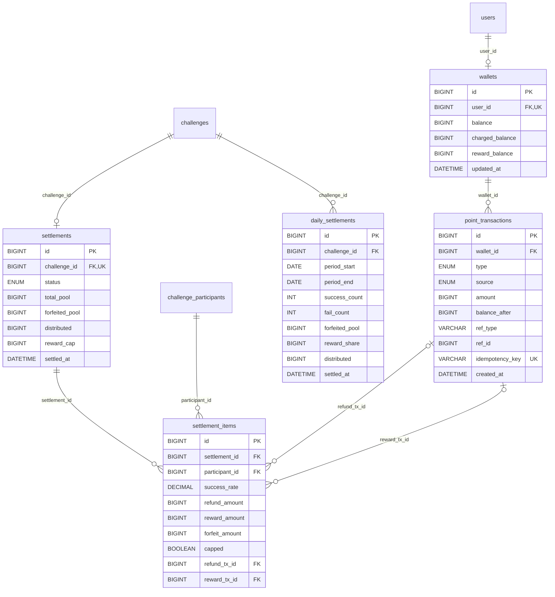

### wallets

포인트 지갑

| 컬럼 | 타입 | NULL | 키 | 기본값 | 설명 |
|---|---|:---:|---|---|---|
| `id` | `BIGINT` |  | PK |  |  |
| `user_id` | `BIGINT` |  | FK, UK |  |  |
| `balance` | `BIGINT` |  |  | 0 | 전체 잔액 캐시 (= charged + reward). 진실의 원천은 point_transactions. SELECT ... FOR UPDATE 락 앵커 |
| `charged_balance` | `BIGINT` |  |  | 0 | 직접 충전한 포인트. 쓰지 않은 만큼만 결제 취소 환불 가능 |
| `reward_balance` | `BIGINT` |  |  | 0 | 챌린지 보상·이벤트 포인트. 상점에서만 사용, 환불·현금화 불가 |
| `updated_at` | `DATETIME` |  |  | CURRENT_TIMESTAMP |  |

- `user_id` → [`users`](#users)

### point_transactions

거래 원장 (INSERT-only, UPDATE/DELETE 금지)

| 컬럼 | 타입 | NULL | 키 | 기본값 | 설명 |
|---|---|:---:|---|---|---|
| `id` | `BIGINT` |  | PK |  |  |
| `wallet_id` | `BIGINT` |  | FK |  |  |
| `type` | `ENUM('CHARGE','CHARGE_CANCEL','ENTRY_FEE','REFUND','REWARD','PURCHASE','PURCHASE_CANCEL','SEASON_BONUS','ADJUST')` |  |  |  | CHARGE_CANCEL = 충전 포인트 환불(결제 취소). REFUND = 챌린지 참가비 환급. PURCHASE_CANCEL = 상점 주문 취소로 돌려받음 |
| `source` | `ENUM('CHARGED','REWARD','SHOP')` |  |  |  | 어느 출처의 포인트가 움직였는지. 환불 로직은 CHARGED 만 본다 |
| `amount` | `BIGINT` |  |  |  | 부호 있는 증감액 (+/-) |
| `balance_after` | `BIGINT` |  |  |  | 거래 후 그 출처(source)의 잔액 |
| `ref_type` | `VARCHAR(20)` | O |  |  | 다형 참조 (participant / settlement / payment / order) |
| `ref_id` | `BIGINT` | O |  |  | FK 없음 - 원장은 참조 대상이 삭제돼도 남아야 함 |
| `idempotency_key` | `VARCHAR(80)` |  | UK |  | 같은 요청 재시도 시 이중 지급/차감 방지 |
| `created_at` | `DATETIME` |  |  | CURRENT_TIMESTAMP |  |

- `wallet_id` → [`wallets`](#wallets)

### settlements

챌린지 정산

| 컬럼 | 타입 | NULL | 키 | 기본값 | 설명 |
|---|---|:---:|---|---|---|
| `id` | `BIGINT` |  | PK |  |  |
| `challenge_id` | `BIGINT` |  | FK, UK |  | 챌린지당 정산 1회 - 배치가 두 번 돌아도 중복 정산 불가 |
| `status` | `ENUM('PENDING','DONE')` |  |  | 'PENDING' |  |
| `total_pool` | `BIGINT` |  |  | 0 | 전체 예치금 합계 |
| `forfeited_pool` | `BIGINT` |  |  | 0 | 실패자 몰수분 (재분배 원천) |
| `distributed` | `BIGINT` |  |  | 0 |  |
| `reward_cap` | `BIGINT` |  |  |  | 적용된 1회 정산당 최대 획득 상한 |
| `settled_at` | `DATETIME` | O |  |  | 매일 자정 cron 배치가 기록 |

- `challenge_id` → [`challenges`](#challenges)

### settlement_items

정산 상세

| 컬럼 | 타입 | NULL | 키 | 기본값 | 설명 |
|---|---|:---:|---|---|---|
| `id` | `BIGINT` |  | PK |  |  |
| `settlement_id` | `BIGINT` |  | FK |  |  |
| `participant_id` | `BIGINT` |  | FK |  |  |
| `success_rate` | `DECIMAL(5,2)` |  |  |  |  |
| `refund_amount` | `BIGINT` |  |  | 0 | 예치금 환급 (부분 성공 시 비례) |
| `reward_amount` | `BIGINT` |  |  | 0 | 실패자 포인트 성공률 비례 배분분 |
| `forfeit_amount` | `BIGINT` |  |  | 0 | 몰수액. 지갑 잔액이 변하지 않아 원장 타입이 아닌 여기에 기록 |
| `capped` | `BOOLEAN` |  |  | FALSE | 획득 상한에 걸렸는지 |
| `refund_tx_id` | `BIGINT` | O | FK |  | 지급 원장 추적 |
| `reward_tx_id` | `BIGINT` | O | FK |  |  |

- 유일: (`settlement_id`, `participant_id`)
- `settlement_id` → [`settlements`](#settlements)
- `participant_id` → [`challenge_participants`](#challenge_participants)
- `refund_tx_id` → [`point_transactions`](#point_transactions)
- `reward_tx_id` → [`point_transactions`](#point_transactions)

### daily_settlements

매일(주) 결과 (지급은 챌린지 종료 시 settlements 로 한 번에)

| 컬럼 | 타입 | NULL | 키 | 기본값 | 설명 |
|---|---|:---:|---|---|---|
| `id` | `BIGINT` |  | PK |  |  |
| `challenge_id` | `BIGINT` |  | FK |  |  |
| `period_start` | `DATE` |  |  |  | 매일 챌린지는 그날, 주 N회는 그 주 첫날 (시작일부터 7일씩) |
| `period_end` | `DATE` |  |  |  |  |
| `success_count` | `INT` |  |  |  | 그 기간 목표를 채운 사람 수 |
| `fail_count` | `INT` |  |  |  | 못 채운 사람 수 (포기한 사람 포함) |
| `forfeited_pool` | `BIGINT` |  |  |  | 못 채운 사람들이 잃은 포인트 합 |
| `reward_share` | `BIGINT` |  |  |  | 성공한 사람 한 명이 받을 보상 (상한 적용 후, 끝날 때 지급) |
| `distributed` | `BIGINT` |  |  |  | 나눠 줄 보상 합 (나머지·상한 초과분은 나누지 않음) |
| `settled_at` | `DATETIME` |  |  |  |  |

- 유일: (`challenge_id`, `period_start`)
- `challenge_id` → [`challenges`](#challenges)

## 05. 결제 (테스트 모드 전용)

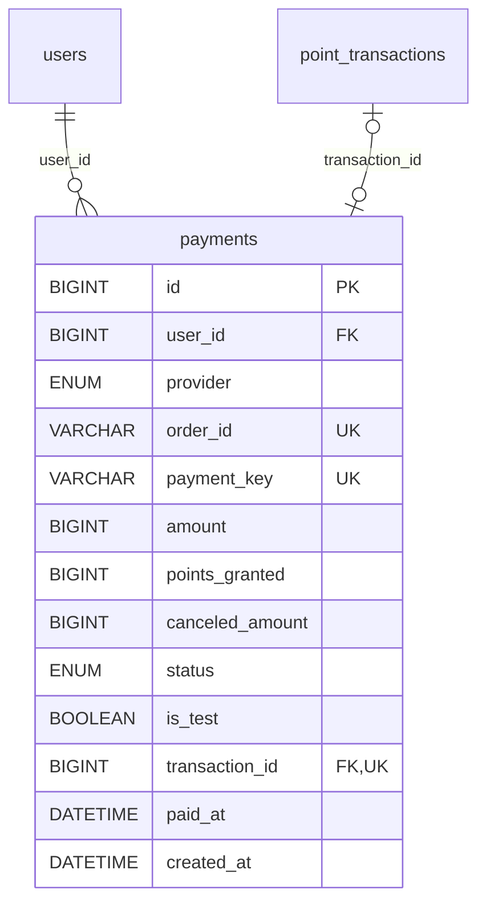

### payments

포인트 충전 결제 (PG 샌드박스)

| 컬럼 | 타입 | NULL | 키 | 기본값 | 설명 |
|---|---|:---:|---|---|---|
| `id` | `BIGINT` |  | PK |  |  |
| `user_id` | `BIGINT` |  | FK |  |  |
| `provider` | `ENUM('TOSS','KAKAOPAY')` |  |  |  | 지금은 토스페이먼츠(TOSS)만 쓴다 |
| `order_id` | `VARCHAR(64)` |  | UK |  | 멱등키 역할. 같은 주문 재처리 방지 |
| `payment_key` | `VARCHAR(200)` | O | UK |  | PG 결제키/토큰만 저장. 카드정보 컬럼 없음. 승인 전에는 NULL |
| `amount` | `BIGINT` |  |  |  | 결제 금액(원) |
| `points_granted` | `BIGINT` |  |  | 0 |  |
| `canceled_amount` | `BIGINT` |  |  | 0 | 결제 취소(충전 포인트 환불)된 금액 합 |
| `status` | `ENUM('READY','PAID','FAILED','CANCELED')` |  |  | 'READY' |  |
| `is_test` | `BOOLEAN` |  |  | TRUE | 샌드박스 결제 여부. 테스트 모드 전용이라 항상 TRUE (프로젝트 규칙 3) |
| `transaction_id` | `BIGINT` | O | FK, UK |  | 충전 원장 연결 |
| `paid_at` | `DATETIME` | O |  |  |  |
| `created_at` | `DATETIME` |  |  | CURRENT_TIMESTAMP |  |

- `user_id` → [`users`](#users)
- `transaction_id` → [`point_transactions`](#point_transactions)

## 06. 랭킹 · 시즌

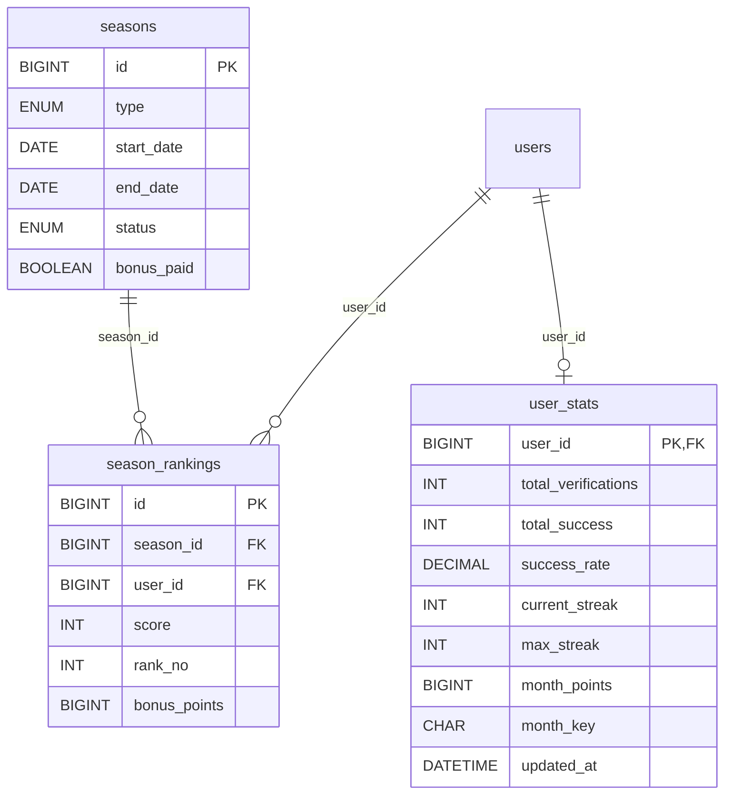

### user_stats

개인 통계 (집계 테이블)

| 컬럼 | 타입 | NULL | 키 | 기본값 | 설명 |
|---|---|:---:|---|---|---|
| `user_id` | `BIGINT` |  | PK, FK |  |  |
| `total_verifications` | `INT` |  |  | 0 |  |
| `total_success` | `INT` |  |  | 0 |  |
| `success_rate` | `DECIMAL(5,2)` |  |  | 0 |  |
| `current_streak` | `INT` |  |  | 0 |  |
| `max_streak` | `INT` |  |  | 0 |  |
| `month_points` | `BIGINT` |  |  | 0 | 이번 달 획득 포인트 |
| `month_key` | `CHAR(7)` |  |  |  | 예: 2026-09 |
| `updated_at` | `DATETIME` |  |  | CURRENT_TIMESTAMP |  |

- `user_id` → [`users`](#users)

### seasons

시즌

| 컬럼 | 타입 | NULL | 키 | 기본값 | 설명 |
|---|---|:---:|---|---|---|
| `id` | `BIGINT` |  | PK |  |  |
| `type` | `ENUM('WEEKLY','MONTHLY')` |  |  |  |  |
| `start_date` | `DATE` |  |  |  |  |
| `end_date` | `DATE` |  |  |  |  |
| `status` | `ENUM('ACTIVE','CLOSED')` |  |  | 'ACTIVE' |  |
| `bonus_paid` | `BOOLEAN` |  |  | FALSE | 시즌 종료 보너스 지급 완료 여부 |

- 유일: (`type`, `start_date`)

### season_rankings

시즌 랭킹

| 컬럼 | 타입 | NULL | 키 | 기본값 | 설명 |
|---|---|:---:|---|---|---|
| `id` | `BIGINT` |  | PK |  |  |
| `season_id` | `BIGINT` |  | FK |  |  |
| `user_id` | `BIGINT` |  | FK |  |  |
| `score` | `INT` |  |  | 0 |  |
| `rank_no` | `INT` | O |  |  | 시즌 종료 시 확정 |
| `bonus_points` | `BIGINT` |  |  | 0 | 상위권 보너스 |

- 유일: (`season_id`, `user_id`)
- `season_id` → [`seasons`](#seasons)
- `user_id` → [`users`](#users)

## 07. 부정행위 방지

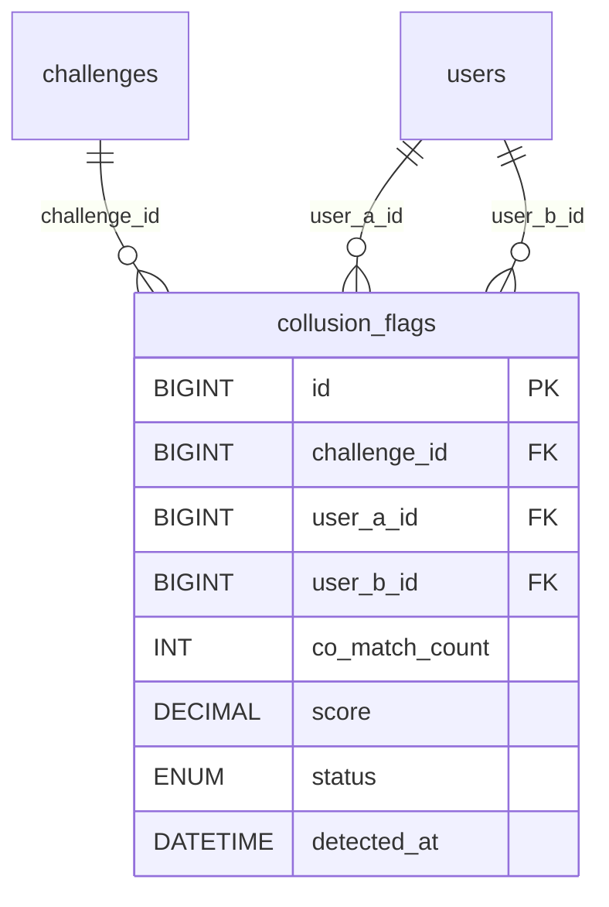

### collusion_flags

담합 의심 플래그

| 컬럼 | 타입 | NULL | 키 | 기본값 | 설명 |
|---|---|:---:|---|---|---|
| `id` | `BIGINT` |  | PK |  |  |
| `challenge_id` | `BIGINT` |  | FK |  |  |
| `user_a_id` | `BIGINT` |  | FK |  | 항상 user_a_id < user_b_id 로 정규화 |
| `user_b_id` | `BIGINT` |  | FK |  |  |
| `co_match_count` | `INT` |  |  |  | 같은 조합이 함께 매칭된 횟수 |
| `score` | `DECIMAL(5,2)` |  |  |  |  |
| `status` | `ENUM('OPEN','CONFIRMED','DISMISSED')` |  |  | 'OPEN' |  |
| `detected_at` | `DATETIME` |  |  | CURRENT_TIMESTAMP |  |

- 유일: (`challenge_id`, `user_a_id`, `user_b_id`)
- `challenge_id` → [`challenges`](#challenges)
- `user_a_id` → [`users`](#users)
- `user_b_id` → [`users`](#users)

## 08. 소셜 · 배지

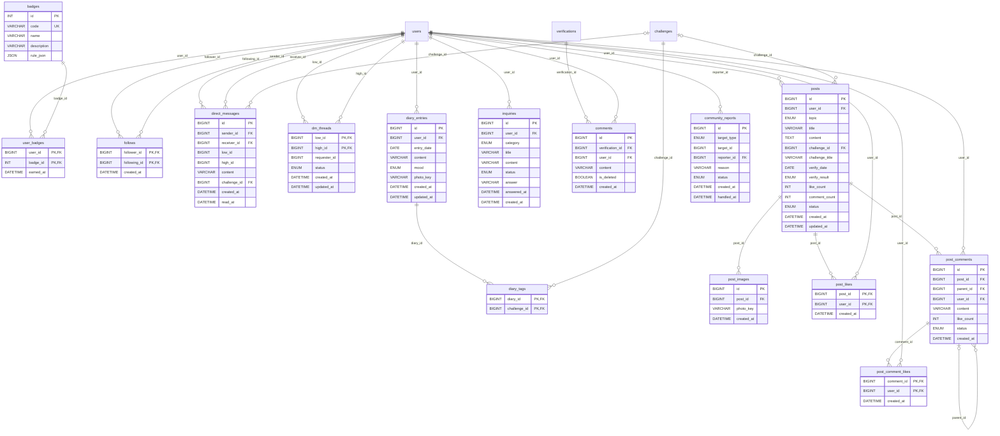

### badges

배지

| 컬럼 | 타입 | NULL | 키 | 기본값 | 설명 |
|---|---|:---:|---|---|---|
| `id` | `INT` |  | PK |  |  |
| `code` | `VARCHAR(30)` |  | UK |  |  |
| `name` | `VARCHAR(50)` |  |  |  |  |
| `description` | `VARCHAR(200)` |  |  |  |  |
| `rule_json` | `JSON` |  |  |  | 획득 조건 |

### user_badges

회원 배지

| 컬럼 | 타입 | NULL | 키 | 기본값 | 설명 |
|---|---|:---:|---|---|---|
| `user_id` | `BIGINT` |  | PK, FK |  |  |
| `badge_id` | `INT` |  | PK, FK |  |  |
| `earned_at` | `DATETIME` |  |  | CURRENT_TIMESTAMP |  |

- `user_id` → [`users`](#users)
- `badge_id` → [`badges`](#badges)

### follows

팔로우

| 컬럼 | 타입 | NULL | 키 | 기본값 | 설명 |
|---|---|:---:|---|---|---|
| `follower_id` | `BIGINT` |  | PK, FK |  |  |
| `following_id` | `BIGINT` |  | PK, FK |  |  |
| `created_at` | `DATETIME` |  |  | CURRENT_TIMESTAMP |  |

- `follower_id` → [`users`](#users)
- `following_id` → [`users`](#users)

### direct_messages

1:1 메시지 (맞팔로우·같은 챌린지는 바로, 그 밖은 메시지 요청)

| 컬럼 | 타입 | NULL | 키 | 기본값 | 설명 |
|---|---|:---:|---|---|---|
| `id` | `BIGINT` |  | PK |  |  |
| `sender_id` | `BIGINT` |  | FK |  |  |
| `receiver_id` | `BIGINT` |  | FK |  |  |
| `low_id` | `BIGINT` |  |  |  | 두 사람 중 작은 id (대화방 묶음) |
| `high_id` | `BIGINT` |  |  |  | 두 사람 중 큰 id |
| `content` | `VARCHAR(500)` |  |  |  |  |
| `challenge_id` | `BIGINT` | O | FK |  | 챌린지 초대 카드면 그 챌린지 (삭제되면 NULL) |
| `created_at` | `DATETIME(3)` |  |  | CURRENT_TIMESTAMP(3) |  |
| `read_at` | `DATETIME` | O |  |  | 받는 사람이 읽은 시각 (안 읽음 표시) |

- `sender_id` → [`users`](#users)
- `receiver_id` → [`users`](#users)
- `challenge_id` → [`challenges`](#challenges) (부모 삭제 시 NULL)

### dm_threads

메시지 요청 (맞팔로우·같은 챌린지가 아닌 사이)

| 컬럼 | 타입 | NULL | 키 | 기본값 | 설명 |
|---|---|:---:|---|---|---|
| `low_id` | `BIGINT` |  | PK, FK |  |  |
| `high_id` | `BIGINT` |  | PK, FK |  |  |
| `requester_id` | `BIGINT` |  |  |  | 요청을 보낸 사람 |
| `status` | `ENUM('PENDING','ACCEPTED','DECLINED')` |  |  | 'PENDING' |  |
| `created_at` | `DATETIME` |  |  | CURRENT_TIMESTAMP |  |
| `updated_at` | `DATETIME` |  |  | CURRENT_TIMESTAMP |  |

- `low_id` → [`users`](#users)
- `high_id` → [`users`](#users)

### diary_entries

갓생기록 일기 (항상 비공개)

| 컬럼 | 타입 | NULL | 키 | 기본값 | 설명 |
|---|---|:---:|---|---|---|
| `id` | `BIGINT` |  | PK |  |  |
| `user_id` | `BIGINT` |  | FK |  |  |
| `entry_date` | `DATE` |  |  |  | 일기의 날짜 (지난 날짜도 쓰고 고칠 수 있다. 하루에 여러 개 쓸 수 있다) |
| `content` | `VARCHAR(500)` |  |  |  | 글 (기분이나 사진만 남기면 빈 문자열) |
| `mood` | `ENUM('GREAT','GOOD','OKAY','SAD','HARD')` | O |  |  | 그날 기분 (최고예요 · 좋아요 · 보통이에요 · 아쉬워요 · 힘들었어요) |
| `photo_key` | `VARCHAR(500)` | O |  |  | 일기에 붙인 사진 파일 키 (본인만 볼 수 있다) |
| `created_at` | `DATETIME` |  |  | CURRENT_TIMESTAMP |  |
| `updated_at` | `DATETIME` |  |  | CURRENT_TIMESTAMP |  |

- `user_id` → [`users`](#users)

### diary_tags

일기에 태그한 챌린지

| 컬럼 | 타입 | NULL | 키 | 기본값 | 설명 |
|---|---|:---:|---|---|---|
| `diary_id` | `BIGINT` |  | PK, FK |  |  |
| `challenge_id` | `BIGINT` |  | PK, FK |  |  |

- `diary_id` → [`diary_entries`](#diary_entries) (부모 삭제 시 함께 삭제)
- `challenge_id` → [`challenges`](#challenges) (부모 삭제 시 함께 삭제)

### inquiries

고객센터 1:1 문의

| 컬럼 | 타입 | NULL | 키 | 기본값 | 설명 |
|---|---|:---:|---|---|---|
| `id` | `BIGINT` |  | PK |  |  |
| `user_id` | `BIGINT` |  | FK |  |  |
| `category` | `ENUM('ACCOUNT','CHALLENGE','POINT','BUG','ETC')` |  |  |  | 계정 · 챌린지/인증 · 포인트 · 오류 신고 · 기타 |
| `title` | `VARCHAR(100)` |  |  |  |  |
| `content` | `VARCHAR(2000)` |  |  |  |  |
| `status` | `ENUM('WAITING','ANSWERED')` |  |  | 'WAITING' |  |
| `answer` | `VARCHAR(2000)` | O |  |  |  |
| `answered_at` | `DATETIME` | O |  |  |  |
| `created_at` | `DATETIME` |  |  | CURRENT_TIMESTAMP |  |

- `user_id` → [`users`](#users)

### comments

응원 댓글

| 컬럼 | 타입 | NULL | 키 | 기본값 | 설명 |
|---|---|:---:|---|---|---|
| `id` | `BIGINT` |  | PK |  |  |
| `verification_id` | `BIGINT` |  | FK |  |  |
| `user_id` | `BIGINT` |  | FK |  |  |
| `content` | `VARCHAR(300)` |  |  |  |  |
| `is_deleted` | `BOOLEAN` |  |  | FALSE |  |
| `created_at` | `DATETIME` |  |  | CURRENT_TIMESTAMP |  |

- `verification_id` → [`verifications`](#verifications)
- `user_id` → [`users`](#users)

### posts

커뮤니티 글

| 컬럼 | 타입 | NULL | 키 | 기본값 | 설명 |
|---|---|:---:|---|---|---|
| `id` | `BIGINT` |  | PK |  |  |
| `user_id` | `BIGINT` |  | FK |  |  |
| `topic` | `ENUM('FREE','REVIEW','TIP','QUESTION')` |  |  |  | 말머리: 자유 · 인증 후기 · 팁 · 질문 |
| `title` | `VARCHAR(100)` |  |  |  |  |
| `content` | `TEXT` |  |  |  |  |
| `challenge_id` | `BIGINT` | O | FK |  | 인증 결과를 붙인 챌린지 (삭제되면 NULL, 아래 제목 · 결과는 남는다) |
| `challenge_title` | `VARCHAR(100)` | O |  |  | 쓴 시점의 챌린지 제목 |
| `verify_date` | `DATE` | O |  |  | 인증 결과의 날짜 (글 쓴 날) |
| `verify_result` | `ENUM('SUCCESS','FAIL')` | O |  |  | 쓴 시점의 그날 인증 결과. 서버가 인증 기록으로 정한다 |
| `like_count` | `INT` |  |  | 0 |  |
| `comment_count` | `INT` |  |  | 0 |  |
| `status` | `ENUM('VISIBLE','HIDDEN','DELETED')` |  |  | 'VISIBLE' | HIDDEN = 신고로 관리자가 가림 |
| `created_at` | `DATETIME` |  |  | CURRENT_TIMESTAMP |  |
| `updated_at` | `DATETIME` | O |  |  |  |

- `user_id` → [`users`](#users)
- `challenge_id` → [`challenges`](#challenges) (부모 삭제 시 NULL)

### post_images

커뮤니티 글 사진 (글마다 4장까지)

| 컬럼 | 타입 | NULL | 키 | 기본값 | 설명 |
|---|---|:---:|---|---|---|
| `id` | `BIGINT` |  | PK |  |  |
| `post_id` | `BIGINT` |  | FK |  |  |
| `photo_key` | `VARCHAR(120)` |  |  |  | 서버 디스크의 파일 키 (post/{postId}/{uuid}.jpg) |
| `created_at` | `DATETIME` |  |  | CURRENT_TIMESTAMP |  |

- `post_id` → [`posts`](#posts) (부모 삭제 시 함께 삭제)

### post_likes

커뮤니티 글 좋아요 (한 사람이 글마다 한 번)

| 컬럼 | 타입 | NULL | 키 | 기본값 | 설명 |
|---|---|:---:|---|---|---|
| `post_id` | `BIGINT` |  | PK, FK |  |  |
| `user_id` | `BIGINT` |  | PK, FK |  |  |
| `created_at` | `DATETIME` |  |  | CURRENT_TIMESTAMP |  |

- `post_id` → [`posts`](#posts) (부모 삭제 시 함께 삭제)
- `user_id` → [`users`](#users)

### post_comments

커뮤니티 댓글

| 컬럼 | 타입 | NULL | 키 | 기본값 | 설명 |
|---|---|:---:|---|---|---|
| `id` | `BIGINT` |  | PK |  |  |
| `post_id` | `BIGINT` |  | FK |  |  |
| `parent_id` | `BIGINT` | O | FK |  | 답글(대댓글)이면 원 댓글. 답글은 한 단계만 둔다 |
| `user_id` | `BIGINT` |  | FK |  |  |
| `content` | `VARCHAR(300)` |  |  |  |  |
| `like_count` | `INT` |  |  | 0 |  |
| `status` | `ENUM('VISIBLE','HIDDEN','DELETED')` |  |  | 'VISIBLE' |  |
| `created_at` | `DATETIME` |  |  | CURRENT_TIMESTAMP |  |

- `post_id` → [`posts`](#posts) (부모 삭제 시 함께 삭제)
- `parent_id` → [`post_comments`](#post_comments) (부모 삭제 시 함께 삭제)
- `user_id` → [`users`](#users)

### post_comment_likes

커뮤니티 댓글 좋아요 (한 사람이 댓글마다 한 번)

| 컬럼 | 타입 | NULL | 키 | 기본값 | 설명 |
|---|---|:---:|---|---|---|
| `comment_id` | `BIGINT` |  | PK, FK |  |  |
| `user_id` | `BIGINT` |  | PK, FK |  |  |
| `created_at` | `DATETIME` |  |  | CURRENT_TIMESTAMP |  |

- `comment_id` → [`post_comments`](#post_comments) (부모 삭제 시 함께 삭제)
- `user_id` → [`users`](#users)

### community_reports

커뮤니티 글 · 댓글 신고

| 컬럼 | 타입 | NULL | 키 | 기본값 | 설명 |
|---|---|:---:|---|---|---|
| `id` | `BIGINT` |  | PK |  |  |
| `target_type` | `ENUM('POST','COMMENT')` |  |  |  |  |
| `target_id` | `BIGINT` |  |  |  | posts.id 또는 post_comments.id |
| `reporter_id` | `BIGINT` |  | FK |  |  |
| `reason` | `VARCHAR(200)` |  |  |  |  |
| `status` | `ENUM('OPEN','ACCEPTED','DISMISSED')` |  |  | 'OPEN' | ACCEPTED = 가림 |
| `created_at` | `DATETIME` |  |  | CURRENT_TIMESTAMP |  |
| `handled_at` | `DATETIME` | O |  |  |  |

- 유일: (`target_type`, `target_id`, `reporter_id`)
- `reporter_id` → [`users`](#users)

## 09. 리텐션

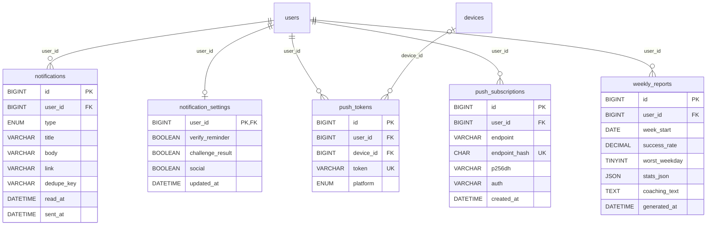

### notifications

알림

| 컬럼 | 타입 | NULL | 키 | 기본값 | 설명 |
|---|---|:---:|---|---|---|
| `id` | `BIGINT` |  | PK |  |  |
| `user_id` | `BIGINT` |  | FK |  |  |
| `type` | `ENUM('SETTLEMENT','VERIFY_REMINDER','COMMENT','REPORT_RESULT','REPORT_ALERT', 'FOLLOW','MESSAGE_REQUEST','INQUIRY_ANSWER','VERIFY_REJECTED','ORDER','TIER','SEASON', 'WEEKLY_REPORT')` |  |  |  |  |
| `title` | `VARCHAR(100)` |  |  |  |  |
| `body` | `VARCHAR(300)` |  |  |  |  |
| `link` | `VARCHAR(200)` | O |  |  | 누르면 갈 화면 주소 |
| `dedupe_key` | `VARCHAR(100)` | O |  |  | 같은 알림을 두 번 만들지 않기 위한 키 (예: verify:{챌린지}:{날짜}) |
| `read_at` | `DATETIME` | O |  |  |  |
| `sent_at` | `DATETIME` |  |  | CURRENT_TIMESTAMP |  |

- 유일: (`user_id`, `dedupe_key`)
- `user_id` → [`users`](#users)

### notification_settings

알림 설정 (줄이 없으면 모두 켜짐)

| 컬럼 | 타입 | NULL | 키 | 기본값 | 설명 |
|---|---|:---:|---|---|---|
| `user_id` | `BIGINT` |  | PK, FK |  |  |
| `verify_reminder` | `BOOLEAN` |  |  | TRUE | 오늘 인증하는 날 알림 |
| `challenge_result` | `BOOLEAN` |  |  | TRUE | 챌린지 종료 · 정산 결과 알림 |
| `social` | `BOOLEAN` |  |  | TRUE | 팔로우 · 메시지 요청 알림 |
| `updated_at` | `DATETIME` |  |  | CURRENT_TIMESTAMP |  |

- `user_id` → [`users`](#users) (부모 삭제 시 함께 삭제)

### push_tokens

푸시 토큰

| 컬럼 | 타입 | NULL | 키 | 기본값 | 설명 |
|---|---|:---:|---|---|---|
| `id` | `BIGINT` |  | PK |  |  |
| `user_id` | `BIGINT` |  | FK |  |  |
| `device_id` | `BIGINT` | O | FK |  |  |
| `token` | `VARCHAR(255)` |  | UK |  |  |
| `platform` | `ENUM('WEB','ANDROID','IOS')` |  |  |  |  |

- `user_id` → [`users`](#users) (부모 삭제 시 함께 삭제)
- `device_id` → [`devices`](#devices) (부모 삭제 시 NULL)

### push_subscriptions

웹 푸시 구독 (브라우저 하나에 한 줄)

| 컬럼 | 타입 | NULL | 키 | 기본값 | 설명 |
|---|---|:---:|---|---|---|
| `id` | `BIGINT` |  | PK |  |  |
| `user_id` | `BIGINT` |  | FK |  |  |
| `endpoint` | `VARCHAR(1000)` |  |  |  | 브라우저 푸시 서비스 주소 (알려진 푸시 서비스 주소만 받는다) |
| `endpoint_hash` | `CHAR(64)` |  | UK |  | endpoint 의 SHA-256. 주소가 길어서 유일 키는 해시에 건다 |
| `p256dh` | `VARCHAR(200)` |  |  |  | 브라우저 공개 키 (본문 암호화용) |
| `auth` | `VARCHAR(100)` |  |  |  | 브라우저 인증 비밀값 (본문 암호화용) |
| `created_at` | `DATETIME` |  |  | CURRENT_TIMESTAMP |  |

- `user_id` → [`users`](#users) (부모 삭제 시 함께 삭제)

### weekly_reports

주간 회고 리포트

| 컬럼 | 타입 | NULL | 키 | 기본값 | 설명 |
|---|---|:---:|---|---|---|
| `id` | `BIGINT` |  | PK |  |  |
| `user_id` | `BIGINT` |  | FK |  |  |
| `week_start` | `DATE` |  |  |  |  |
| `success_rate` | `DECIMAL(5,2)` |  |  |  |  |
| `worst_weekday` | `TINYINT` | O |  |  | 가장 자주 실패한 요일 (1=월 ~ 7=일) |
| `stats_json` | `JSON` |  |  |  |  |
| `coaching_text` | `TEXT` |  |  |  |  |
| `generated_at` | `DATETIME` |  |  | CURRENT_TIMESTAMP |  |

- 유일: (`user_id`, `week_start`)
- `user_id` → [`users`](#users)

## 10. 마켓플레이스

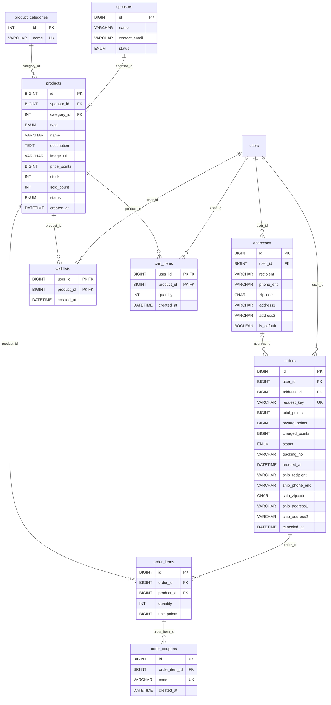

### sponsors

스폰서

| 컬럼 | 타입 | NULL | 키 | 기본값 | 설명 |
|---|---|:---:|---|---|---|
| `id` | `BIGINT` |  | PK |  |  |
| `name` | `VARCHAR(100)` |  |  |  |  |
| `contact_email` | `VARCHAR(255)` |  |  |  |  |
| `status` | `ENUM('ACTIVE','SUSPENDED')` |  |  | 'ACTIVE' |  |

### product_categories

상품 카테고리

| 컬럼 | 타입 | NULL | 키 | 기본값 | 설명 |
|---|---|:---:|---|---|---|
| `id` | `INT` |  | PK |  |  |
| `name` | `VARCHAR(30)` |  | UK |  | 운동용품 · 문구류 · 생활용품 … |

### products

상품

| 컬럼 | 타입 | NULL | 키 | 기본값 | 설명 |
|---|---|:---:|---|---|---|
| `id` | `BIGINT` |  | PK |  |  |
| `sponsor_id` | `BIGINT` |  | FK |  |  |
| `category_id` | `INT` |  | FK |  |  |
| `type` | `ENUM('PHYSICAL','COUPON')` |  |  | 'PHYSICAL' | PHYSICAL = 배송받는 실물, COUPON = 이용권 · 상품권 (배송 없이 쿠폰 번호 발급) |
| `name` | `VARCHAR(150)` |  |  |  |  |
| `description` | `TEXT` |  |  |  |  |
| `image_url` | `VARCHAR(500)` |  |  | '' | 상품 사진 주소. 비어 있으면 화면이 기본 그림을 보여 준다 |
| `price_points` | `BIGINT` |  |  |  |  |
| `stock` | `INT` |  |  | 0 |  |
| `sold_count` | `INT` |  |  | 0 | 판매 수량 (인기순 정렬용) |
| `status` | `ENUM('ON_SALE','SOLD_OUT','HIDDEN')` |  |  | 'ON_SALE' |  |
| `created_at` | `DATETIME` |  |  | CURRENT_TIMESTAMP |  |

- `sponsor_id` → [`sponsors`](#sponsors)
- `category_id` → [`product_categories`](#product_categories)

### addresses

배송지

| 컬럼 | 타입 | NULL | 키 | 기본값 | 설명 |
|---|---|:---:|---|---|---|
| `id` | `BIGINT` |  | PK |  |  |
| `user_id` | `BIGINT` |  | FK |  |  |
| `recipient` | `VARCHAR(50)` |  |  |  |  |
| `phone_enc` | `VARCHAR(100)` |  |  |  | 받는 사람 연락처의 암호화 값 (AES-GCM, 본인에게만 다시 보여 준다) |
| `zipcode` | `CHAR(5)` |  |  |  |  |
| `address1` | `VARCHAR(200)` |  |  |  |  |
| `address2` | `VARCHAR(200)` |  |  | '' |  |
| `is_default` | `BOOLEAN` |  |  | FALSE |  |

- `user_id` → [`users`](#users)

### wishlists

찜

| 컬럼 | 타입 | NULL | 키 | 기본값 | 설명 |
|---|---|:---:|---|---|---|
| `user_id` | `BIGINT` |  | PK, FK |  |  |
| `product_id` | `BIGINT` |  | PK, FK |  |  |
| `created_at` | `DATETIME` |  |  | CURRENT_TIMESTAMP |  |

- `user_id` → [`users`](#users) (부모 삭제 시 함께 삭제)
- `product_id` → [`products`](#products) (부모 삭제 시 함께 삭제)

### cart_items

장바구니

| 컬럼 | 타입 | NULL | 키 | 기본값 | 설명 |
|---|---|:---:|---|---|---|
| `user_id` | `BIGINT` |  | PK, FK |  |  |
| `product_id` | `BIGINT` |  | PK, FK |  |  |
| `quantity` | `INT` |  |  |  |  |
| `created_at` | `DATETIME` |  |  | CURRENT_TIMESTAMP |  |

- `user_id` → [`users`](#users) (부모 삭제 시 함께 삭제)
- `product_id` → [`products`](#products) (부모 삭제 시 함께 삭제)

### orders

주문

| 컬럼 | 타입 | NULL | 키 | 기본값 | 설명 |
|---|---|:---:|---|---|---|
| `id` | `BIGINT` |  | PK |  |  |
| `user_id` | `BIGINT` |  | FK |  |  |
| `address_id` | `BIGINT` | O | FK |  | 고른 배송지 (지우면 NULL, 쿠폰만 산 주문은 처음부터 NULL). 실제 배송 정보는 ship_* 에 주문 시점 값으로 남긴다 |
| `request_key` | `VARCHAR(80)` |  | UK |  | 멱등키. 주문 버튼 중복 클릭 방지 |
| `total_points` | `BIGINT` |  |  |  |  |
| `reward_points` | `BIGINT` |  |  | 0 | 보상 포인트로 낸 금액 |
| `charged_points` | `BIGINT` |  |  | 0 | 충전 포인트로 낸 금액 |
| `status` | `ENUM('PREPARING','SHIPPING','DELIVERED','CANCELED')` |  |  | 'PREPARING' |  |
| `tracking_no` | `VARCHAR(50)` | O |  |  |  |
| `ordered_at` | `DATETIME` |  |  | CURRENT_TIMESTAMP |  |
| `ship_recipient` | `VARCHAR(50)` | O |  |  | 주문 시점의 받는 사람 |
| `ship_phone_enc` | `VARCHAR(100)` | O |  |  | 주문 시점의 연락처 (암호화) |
| `ship_zipcode` | `CHAR(5)` | O |  |  |  |
| `ship_address1` | `VARCHAR(200)` | O |  |  |  |
| `ship_address2` | `VARCHAR(200)` | O |  |  |  |
| `canceled_at` | `DATETIME` | O |  |  |  |

- `user_id` → [`users`](#users)
- `address_id` → [`addresses`](#addresses) (부모 삭제 시 NULL)

### order_items

주문 상품

| 컬럼 | 타입 | NULL | 키 | 기본값 | 설명 |
|---|---|:---:|---|---|---|
| `id` | `BIGINT` |  | PK |  |  |
| `order_id` | `BIGINT` |  | FK |  |  |
| `product_id` | `BIGINT` |  | FK |  |  |
| `quantity` | `INT` |  |  |  |  |
| `unit_points` | `BIGINT` |  |  |  | 주문 시점 가격 스냅샷 |

- `order_id` → [`orders`](#orders)
- `product_id` → [`products`](#products)

### order_coupons

쿠폰 상품(이용권 · 상품권)을 사면 수량만큼 발급하는 쿠폰 번호

| 컬럼 | 타입 | NULL | 키 | 기본값 | 설명 |
|---|---|:---:|---|---|---|
| `id` | `BIGINT` |  | PK |  |  |
| `order_item_id` | `BIGINT` |  | FK |  |  |
| `code` | `VARCHAR(30)` |  | UK |  | 발급한 쿠폰 번호 (포트폴리오용 가상 번호) |
| `created_at` | `DATETIME` |  |  | CURRENT_TIMESTAMP |  |

- `order_item_id` → [`order_items`](#order_items)
